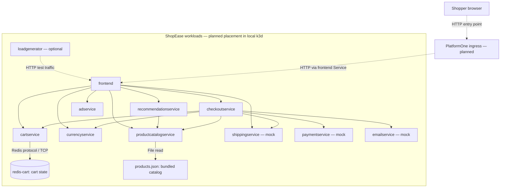
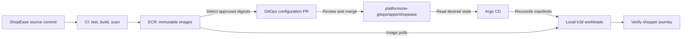

# ShopEase product architecture

Status: Application dependencies checked against the current source and configuration. The PlatformOne Kubernetes placement and delivery path below are the intended design; deployment validation is pending.

[Product overview](product-overview.md) · [Critical user journey](critical-user-journey.md)

## Application and planned deployment

The frontend serves the shopper's HTTP requests and calls backend services over gRPC. Checkout coordinates the simulated purchase. Redis holds mutable cart state; the catalog reads a bundled JSON file.

Solid arrows show application calls or data access. Dashed arrows show the planned ingress path or optional test traffic. The box represents the intended Kubernetes application boundary, not an already verified deployment. Service names match the source configuration.

All unlabelled service-to-service arrows represent gRPC calls. Arrows show dependencies, not the order of execution. Responses return to the caller along the same connection.

The intended external entry point is ingress to the frontend; backend services and Redis remain internal. In the existing Docker Compose setup, the browser instead connects directly to `localhost:8080`, and Redis is also published on host port `6379`. That local exposure is not the intended Kubernetes access policy. TLS, ingress configuration, and network-policy enforcement still need implementation and testing.

## Connection reference

These ports come from the current upstream Kubernetes manifests. Compose uses the same backend ports and exposes the frontend directly on 8080.

| Destination | Protocol / port | Callers |
| --- | --- | --- |
| `frontend` | HTTP Service 80 → container 8080 | Planned ingress; optional load generator |
| `productcatalogservice` | gRPC 3550 | Frontend, checkout, recommendations |
| `currencyservice` | gRPC 7000 | Frontend, checkout |
| `cartservice` | gRPC 7070 | Frontend, checkout |
| `shippingservice` | gRPC 50051 | Frontend, checkout |
| `checkoutservice` | gRPC 5050 | Frontend |
| `recommendationservice` | gRPC 8080 | Frontend |
| `adservice` | gRPC 9555 | Frontend |
| `paymentservice` | gRPC 50051 | Checkout |
| `emailservice` | gRPC 5000 | Checkout |
| `redis-cart` | Redis TCP 6379 | Cart service |

Use this table when configuring service addresses and application network allow rules. DNS and any enabled telemetry or external integrations require separate allowances; this is not a complete egress-policy specification.

## How the purchase travels through the services

1. The frontend obtains catalog, currency, and cart data to render the store. It also requests recommendations, ads, and shipping information on relevant pages.
2. Adding an item calls the cart service, which stores the shopper's cart in Redis.
3. On checkout, the checkout service retrieves cart items, product details, currency conversions, and a shipping quote.
4. Checkout calls mock payment, then mock shipping, attempts to empty the cart, and calls mock email before returning the order result to the frontend.
5. The frontend renders the order confirmation. The [journey test definition](critical-user-journey.md) requires a separate cart check afterward.

Payment occurs before shipment. Email failures are logged without failing the order, and the cart-clearing error is ignored by the current checkout code. These details explain why an order confirmation alone is not sufficient journey evidence.

## State and optional features

- **Redis:** stores carts. The upstream Kubernetes manifest uses `emptyDir`; it does not guarantee cart survival after Pod replacement. Persistent storage and Redis persistence are planned decisions to validate, not completed capabilities.
- **Catalog:** reads `products.json` from the application image. Updating the default catalog is an application release change.
- **Orders:** the default application has no durable order database or payment ledger.
- **Load generator:** optional test tooling; it is not a shopper-facing service.
- **Shopping assistant and cloud integrations:** outside the initial diagram. Compose supplies an assistant address but does not enable the feature or define an assistant container. Telemetry integrations must be shown when they are actually configured.

## Planned delivery path

This is how application artifacts and deployment configuration will meet. It is separate from shopper request traffic.

`akansof-org/shopease` owns application code, Dockerfiles, tests, CI, and docs. `akansof-org/platformone-gitops` owns deployed configuration and Argo CD registration. Updating an image in ECR alone does not change the GitOps deployment; the approved digest must be updated in Git.

## Sources and validation boundary

- [Compose configuration](../docker-compose.yml)
- [Frontend connections](../src/frontend/main.go) and [request handlers](../src/frontend/handlers.go)
- [Checkout connections and order flow](../src/checkoutservice/main.go)
- [Recommendation service](../src/recommendationservice/recommendation_server.py)
- [Cart service configuration](../src/cartservice/src/Startup.cs)
- [Upstream Kubernetes manifests](../kubernetes-manifests/), including [frontend](../kubernetes-manifests/frontend.yaml) and [cart/Redis](../kubernetes-manifests/cartservice.yaml)
- [Detailed communication study](<notes and research/interservice-communication-flows.md>)

These Mermaid diagrams can be viewed in GitHub's Markdown preview. The source connections have been reviewed; live traffic, ingress routing, persistence, image delivery, and network isolation remain to be verified during deployment. Update this document when the implemented configuration changes the design.
